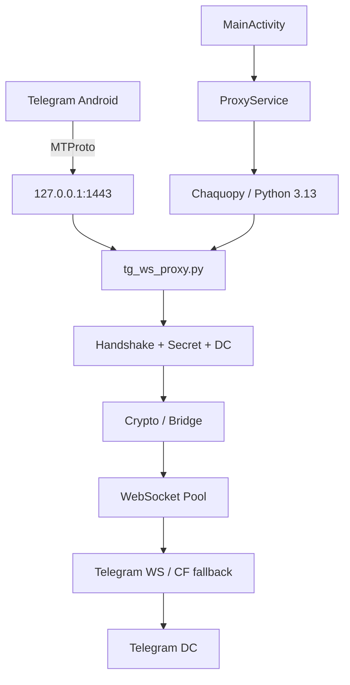

<div align="center">


# TG WS Proxy for Android

**Минималистичный Android-порт WebSocket MTProto-прокси на базе открытого ядра Flowseal.**

[](#требования)
[](#структура-проекта)
[](#как-это-работает)
[](#лицензия)

</div>

---

## ✨ Что это

**TG WS Proxy for Android** — Android-приложение, которое запускает локальный MTProto-прокси на телефоне и передаёт Telegram-трафик через WebSocket-транспорт.

Сетевое ядро основано на открытом проекте **Flowseal/tg-ws-proxy**. Android-часть добавляет UI, foreground service, диагностику, статистику и управление жизненным циклом Python-процесса.

Приложение рассчитано на локальное использование: Telegram на том же устройстве подключается к прокси через:

```text
127.0.0.1:1443
```

> **Важно:** это не системный VPN и не универсальный прокси для всего телефона. Основной сценарий — работа Telegram через локальный MTProto endpoint.

---

## 🚀 Возможности

| Возможность | Описание |
|---|---|
| 🟢 Локальный MTProto | Listener на `127.0.0.1:1443` |
| 🌐 WebSocket bridge | Передача Telegram-трафика через WS-транспорт |
| ☁️ CF fallback | Поддержка резервного Cloudflare-маршрута из ядра |
| ⚡ WS pool | Предварительное заполнение WebSocket-пула |
| 📱 Android Service | Запуск в foreground service |
| 🔘 Quick Settings | Быстрое включение/выключение из шторки |
| 📡 Live status | Статусы прокси, Telegram и WebSocket |
| 📊 Traffic stats | Скорость, общий трафик, uptime |
| 🔁 Auto-restart | Повторный запуск после неожиданного падения |
| 🧪 Diagnostics | Проверка Python, crypto, secret и локального listener |
| 📜 Debug log | Ротируемый лог с маскированием secret |
| 🔳 QR-код | Генерация локальной `tg://proxy` ссылки |
| 🔄 Update checker | Проверка последнего GitHub Release |

---

## 🧩 Как это работает

Главная идея проекта — оставить оригинальную сетевую логику Flowseal практически без изменений, а вокруг неё построить Android-обвязку.



### По шагам

1. **Telegram** подключается к `127.0.0.1:1443` как к обычному MTProto-прокси.
2. Локальный listener принимает соединение и получает MTProto handshake.
3. Ядро проверяет secret, определяет нужный DC и подготавливает транспорт.
4. Для выхода наружу выбирается WebSocket-соединение из пула.
5. При необходимости используется резервный CF-маршрут.
6. `bridge` гоняет данные в обе стороны между локальным MTProto-соединением и WebSocket transport.
7. Android Service следит за состоянием Python-потока и при включённом автоперезапуске пытается восстановить прокси после падения.

---

## 🏗️ Архитектура приложения

Проект условно состоит из двух слоёв.

### Android-слой

```text
app/src/main/java/com/shinyk/tgwsproxy/
├── MainActivity.kt          # главный экран
├── ProxyService.kt          # foreground service и мониторинг
├── ProxyTileService.kt      # Quick Settings
├── DiagnosticsActivity.kt   # диагностика и debug log
└── QrActivity.kt            # QR-код для tg://proxy
```

### Python-слой

```text
app/src/main/python/
├── android_proxy.py         # мост Android ↔ Flowseal
└── proxy/
    ├── tg_ws_proxy.py      # основной сервер
    ├── bridge.py            # двусторонний transport bridge
    ├── raw_websocket.py     # WebSocket transport
    ├── pool.py              # пул WS-соединений
    ├── balancer.py          # балансировка
    ├── config.py            # конфигурация
    ├── fake_tls.py          # TLS/transport helper
    ├── _aes.py              # AES primitives
    ├── stats.py             # статистика
    └── utils.py             # вспомогательные функции
```

Android запускает Python через **Chaquopy**, поэтому исходное сетевое ядро остаётся Python-кодом внутри APK.

---

## 🔐 Secret и подключение Telegram

При первом запуске приложение генерирует локальный 32-символьный hex secret и сохраняет его в настройках приложения.

Для подключения используется ссылка вида:

```text
tg://proxy?server=127.0.0.1&port=1443&secret=dd<SECRET>
```

В приложении доступны:

- **Telegram** — открыть ссылку автоматически;
- **Копировать** — скопировать ссылку;
- **QR-код** — показать ссылку как QR.

### Ручная настройка

В Telegram укажи:

```text
Тип:     MTProto
Сервер:  127.0.0.1
Порт:    1443
Secret:  <SECRET>
```

> **Не публикуй свой реальный secret в README, Issues или скриншотах.**

---

## 📈 Live status и статистика

На главном экране приложение отслеживает:

```text
Прокси      ●
Telegram    ●
WebSocket   ●
```

Также показываются:

- входящая и исходящая скорость;
- общий объём входящего и исходящего трафика;
- время работы текущей сессии;
- число переподключений WebSocket.

Статистика берётся из counters самого Python-ядра, а скорость вычисляется Android-сервисом по разнице counters между измерениями.

---

## 🧪 Диагностика

Раздел **Настройки → Диагностика** предназначен для поиска проблем без USB и без остановки работающего прокси.

Проверяются:

```text
✓ Python runtime
✓ импорт proxy-модуля
✓ cryptography
✓ AES-CTR
✓ формат secret
✓ локальный listener
```

Debug log хранится локально и вращается по размеру. Secret автоматически маскируется при записи.

Доступны действия:

```text
Обновить лог
Скопировать лог
Поделиться логом
Очистить лог
Запустить диагностику
Показать QR
Добавить Quick Settings
Проверить обновления
```

---

## 🔄 Восстановление после сбоя

При включённом **Автоперезапуске** приложение периодически опрашивает состояние Python-прокси.

Если пользователь оставил прокси включённым, а Python-поток неожиданно завершился, сервис пытается автоматически запустить его снова.

Дополнительно Android service использует `START_STICKY`, чтобы система могла восстановить сервис после уничтожения процесса, когда это допускает политика ОС.

---

## 🔘 Quick Settings

Плитка **TG Proxy** позволяет включать и выключать прокси из шторки Android.

На поддерживаемых версиях Android приложение также может запросить добавление плитки из раздела настроек.

---

## 🔳 QR-код

QR-код содержит текущую `tg://proxy` ссылку с локальным endpoint:

```text
server = 127.0.0.1
port   = 1443
secret = текущий secret приложения
```

---

## 🔄 Проверка обновлений

В настройках приложение может проверять последний опубликованный GitHub Release.

Для этого при сборке нужно указать репозиторий:

```bash
./gradlew assembleDebug -PgithubRepo=OWNER/REPO
```

или задать в `gradle.properties`:

```properties
githubRepo=OWNER/REPO
```

После этого приложение использует GitHub Releases API и сравнивает найденный `tag_name` с текущей версией APK.

---

## 🛠️ Сборка

### Требования

- Android Studio;
- JDK 17;
- Android SDK 35;
- Gradle 8.11.1 совместимой конфигурации;
- рабочее интернет-соединение для загрузки Gradle/Chaquopy зависимостей.

В проекте используется:

```text
compileSdk   35
minSdk       24
Kotlin       2.1.20
Chaquopy     17.0.0
Python       3.13
cryptography 42.0.8
```

### Debug APK

В Android Studio используй:

```text
Build
→ Generate App Bundles or APKs
→ Generate APK(s)
```

Готовый APK будет находиться в:

```text
app/build/outputs/apk/debug/app-debug.apk
```

### Через Gradle

Если в окружении доступен Gradle:

```bash
gradle :app:assembleDebug
```

---

## 📦 GitHub и CI

Для репозитория рекомендуется хранить исходники, а `build/`, `.gradle/`, `__pycache__/` и `local.properties` не коммитить — они уже исключены в `.gitignore` этого проекта.

Рекомендуемый цикл:

```text
изменение кода
      ↓
git commit
      ↓
git push
      ↓
GitHub Actions
      ↓
APK
      ↓
GitHub Release
```

---

## 📝 Версии

### V0.5

- новый минималистичный тёмный интерфейс;
- анимированный индикатор состояния;
- live status для Proxy / Telegram / WebSocket;
- скорость и общий трафик;
- uptime;
- счётчик WS reconnects;
- Quick Settings;
- QR-код;
- улучшенная диагностика;
- ротируемый debug log с маскированием secret;
- автоперезапуск после неожиданного падения;
- проверка новых GitHub Releases;
- launcher icon.

---

## ⚠️ Ограничения и безопасность

- Приложение слушает локальный адрес `127.0.0.1`, а не `0.0.0.0`.
- Это не VPN и не перехватывает произвольный трафик Android.
- Secret является частью конфигурации доступа к локальному MTProto endpoint и не должен публиковаться.
- При публичном распространении APK стоит использовать собственный release signing key и хранить его отдельно от репозитория.
- Перед публикацией производных сборок необходимо учитывать лицензии исходного Flowseal-кода и зависимостей.

---

## 📄 Лицензия

Сетевое ядро этого проекта основано на коде **Flowseal/tg-ws-proxy**, распространяемом по **MIT License**.

В репозитории сохраняется исходный `LICENSE`. Android-обвязка является частью этого порта; перед публичным релизом проверьте требования к атрибуции для всех используемых компонентов и библиотек.

---

## 🙌 Благодарности

- **Flowseal** — за открытое Python-ядро `tg-ws-proxy`;
- **Chaquopy** — за интеграцию Python с Android;
- разработчикам Android и использованных open-source библиотек.

---

<div align="center">

### TG WS Proxy for Android

**Простой интерфейс. Локальный прокси. WebSocket transport.**

</div>
